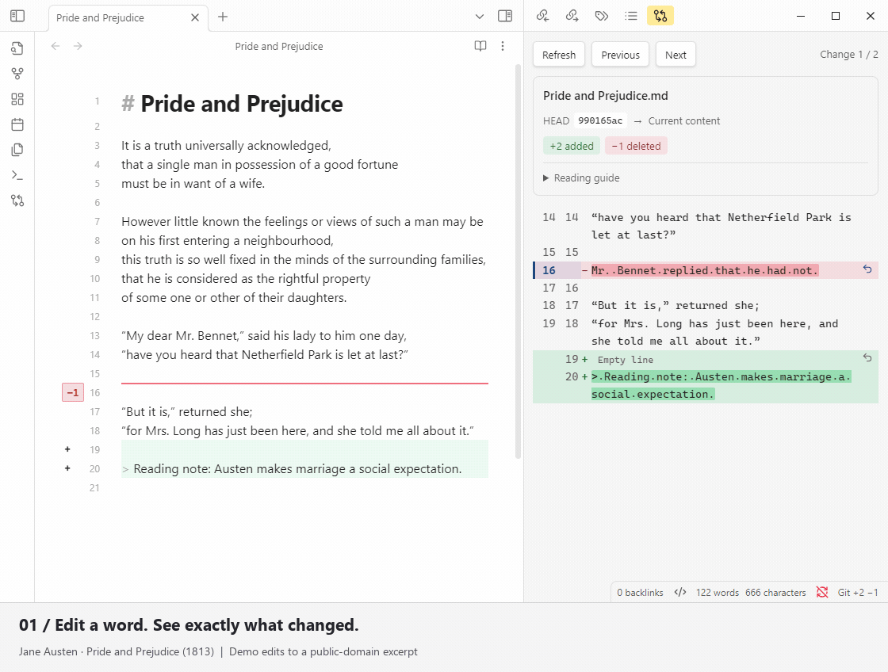

# Better MD Diff

[English](README.md)

在 Obsidian 中查看 Markdown 相对 **Git HEAD（最近一次提交）** 的增删，突出变化字词，并逐项确认还原。

《傲慢与偏见》节选及演示改动，英文 Obsidian 实录。

## 安装

需要桌面版 **Obsidian 1.8.0+** 和本机 **Git**。

在“设置 → 第三方插件 → 浏览”中搜索 **Better MD Diff**，安装并启用。

## 使用

1. 打开已被 Git 跟踪的 Markdown 文档，在源码编辑或实时预览中修改。
2. 点击侧边差异标记或 Git 差异图标查看对照：**红色是旧文，绿色是新增内容**。
3. 点击行尾还原箭头，核对预览后确认；在原文编辑器按 **Ctrl/Cmd+Z** 撤销。

连续多行替换算一项改动。插件不会暂存、提交或推送；重要笔记请先备份。

## 许可证

[MIT](LICENSE)。依赖 jsdiff 使用 BSD-3-Clause，完整许可随构建附带。
