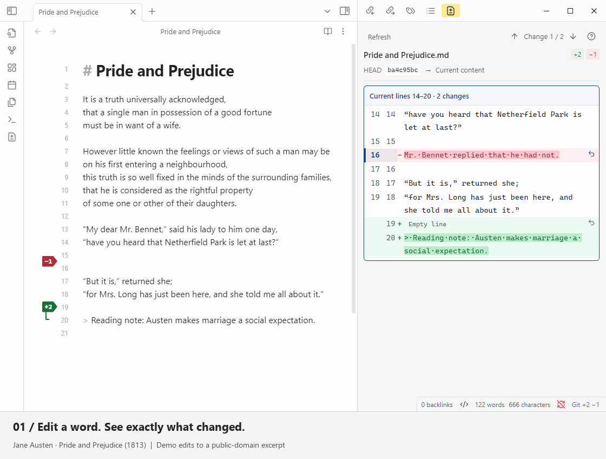

# Better MD Diff

[English](README.md)

在 Obsidian 中查看 Markdown 相对 **Git HEAD（最近一次提交）** 的增删，突出变化字词，并逐项确认还原。

《傲慢与偏见》节选及演示改动，使用插件 0.4.0 在桌面版英文 Obsidian 中实录。[演示说明](docs/demo.md) · [0.4.1 更新说明](docs/releases/0.4.1.md)。

**0.4.1 修复重复空行附近的段落错配**，包括由此产生的误导性删除旗标与逐项还原范围。

## 安装

需要桌面版 **Obsidian 1.8.0+** 和本机 **Git**。

在“设置 → 第三方插件 → 浏览”中搜索 **Better MD Diff**，安装并启用。已安装的用户可在第三方插件设置中检查更新，再更新 Better MD Diff。

## 使用

1. 打开已被 Git 跟踪的 Markdown 文档，在源码编辑或实时预览中修改。
2. 点击编辑区旗标或左侧 **Git 差异**图标查看对照。面板中，**红色文字是旧文，绿色文字是新增内容**；更深的局部底色突出变化字词。
3. 用 **↑ / ↓** 逐项导航。点击区块标题选中其中第一项，点击改动项的行号按钮选中该项；是否同步定位左侧原文由设置控制。
4. 点击行尾还原箭头，核对预览后确认；在原文编辑器按 **Ctrl/Cmd+Z** 撤销。

### 编辑区旗标

| 旗标 | 含义 |
| --- | --- |
| 绿色 `+n` | 当前文档新增了 `n` 行 |
| 蓝色 `~n` | 当前文档有 `n` 行被修改 |
| 红色 `−n` | 旧文删除了 `n` 行，仅标记删除边界，不把下一行视为删除内容 |

新增/修改范围只在起点显示旗标，并用侧边细线标出范围。正文不染色，固定宽度的标记区避免刷新时正文左右跳动。大计数的完整值保留在悬停提示中。渲染后的表格、折叠块显示所含第一项改动的旗标，精确范围请看右侧面板。旗标只在源码编辑和实时预览中显示，阅读模式不显示。

### 改动数与阅读区块

**改动 1 / 3** 统计独立改动项，不是卡片数量。相邻改动会共用上下文，因此两个区块可以分别包含 **2 处改动**和 **1 处改动**；标题会标明行范围与本块改动数。连续多行替换算一项改动，阅读分组不会扩大还原范围。

正文可拖选并复制为原始 Markdown，不带控件和行号。设置中保留字号、字词/空白标记、原文联动选项；点击 **?** 查看阅读说明。

插件不会暂存、提交或推送。还原前会校验当前正文与 Git 基准，再执行一次可撤销的编辑；重要笔记请先备份。

## 当前范围

当前版本对比的是**本地 Git HEAD**。基于认可内容的审阅工作流、GitLab 版本对比尚未开放。

## 许可证

[MIT](LICENSE)。依赖 jsdiff 使用 BSD-3-Clause，完整许可随构建附带。
